{width=80%}

# Programmieren mit Phaser

## 1 Was wird programmiert

Es wird ein Reaktionsspiel erstellt, in dem man die ausgeschriebenen Farben anhand von farbigen Schaltflächen auswählen muss. Die geschriebene Form der Farbe soll ebenfalls in einer zufälligen Farbe angezeigt werden und sich immer wieder zufällig wechseln.

Es wird ebenfalls ein Counter, eine Levelanzeige als auch die Anzahl der bereits richtig ausgewählten Farben im oberen Bereich des Spiels geben.

Das Spiel soll am Ende ungefähr wie hier aussehen, am besten noch bunter!

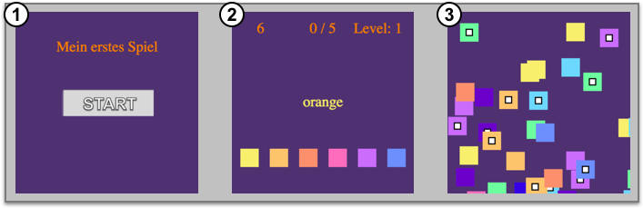

1. Startbildschirm
2. Das ist ein Ausschnitt aus dem Spiel
3. GameOver Screen

#### Selbstgemacht

Wem die Farben noch zu langeweilig sind, der kann selber ein quadrat auf ein Blatt malen und das fertige Muster als Bild einfügen. Wie das geht erfährt man ab dem 5. Abschnitt.

## 2 Benötigte Werkzeuge

Das Spiel wird am Ende in einem Browser laufen und somit auf dem PC als auch auf dem Smartphone verfügbar sein. Wie auch alle anderen Websites wird auch für dieses Projekt HTML, CSS und JavaScript verwendet. Der größte Teil, das Spiel selbst, wird in JavaScript erstellt. 

### 2.1 Was für Software braucht man

Für den CoderDojo wird eine Lösung gewählt die keine Installation braucht. Alles findet im Internet statt. Das Gute dabei ist, dass man auch später mit seinem eigenen PC direkt auf sein Projekt zugreifen und weiter machen kann. 
Um die Entwicklungsumgebung für das Spiel vorzubereiten muss man folgende Schritte nacheinander durchführen:

1. Erstellt ein Profil auf der Website von Cloud9 ([http://c9.io/signup](https://c9.io/signup)) 
   (Solltest man bereits einen Account bei [GitHub](http://github.com) besitzen, so kannst man diesen verwenden um sich auf <b>Cloud9</b> anzumelden.)

2. Nach der Anmeldung wird man zum Profil weitergeleitet. Dieses sollte wie auf folgendem Bild aussehen: 
 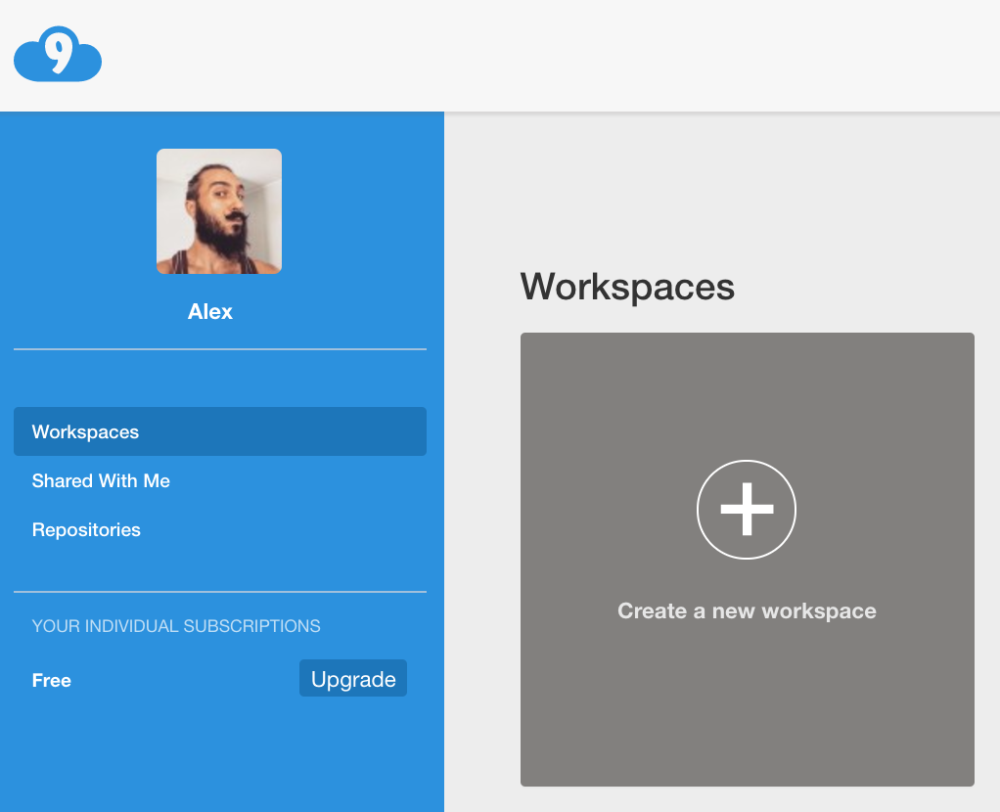{width=350px}

3. Füge einen neuen Workspace über die graue Schaltfläche hinzu ( "Create a new workspace" )

4. Nun müssen in einem letzten Schritt noch einige Daten angegeben werden. 
    
     <b>1</b> Workspace name 
     <b>2</b> Description name
   	 <b>3</b> Die Adresse für Phaser das wir für unser Spiel brauchen
   	 			https://github.com/photonstorm/phaser.git
   	 <b>4</b> Wähle HTML aus, da alle Elemente im Browser angezeigt werden.
     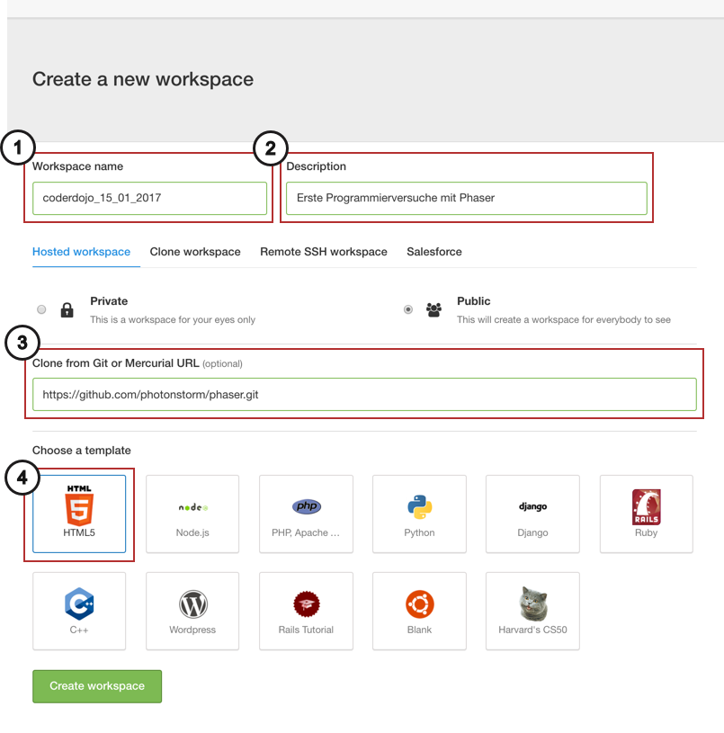{width=450px}

Wer eine eigene Website besitzt, der findet auf [folgender Website](https://phaser.io/tutorials/getting-started/part2) eine genaue Anleitung wie man Phaser auf dem eigenen Computer zum laufen bringt.

### 2.2 Das Projekt

... sollte man nun folgenden Bildschirm vor sich sehen. 
Wichtig ist, dass ihr mehrere Ordner aufgelistet bekommt die Phaser beinhalten.
 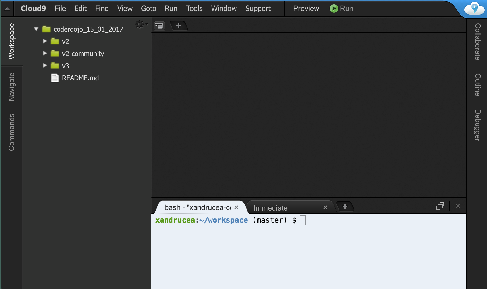{width=70%}

## 3. Beschreibung der Werkzeuge

Jeder Programmiersprache die es gibt, besitzt bereits vorhandene Funktionen die einem z.B. helfen, Aufgaben zu berechnen oder das Aussehen von der Oberfläche zu ändern. Man beginnt somit nicht ganz am Anfang und muss nicht alles komplett alleine neu programmieren. Es gilt viel mehr diese vorhandenen Funktionen zu verwenden um seine eigene Idee umzusetzen.

Unser Spiel wird im Browser laufen und mit Hilfe von HTML, CSS und Javascrit umgesetzt. HTML ist dazu da, zu beschreiben was für ein Inhalt auf einer Website erscheinen wird. Hier werden Texte, Bilder, Verlinkungen und andere Inhalte eingefügt. CSS lässt uns Elemente äußerlich verändern (Wird in diesem Projekt nicht verwendet). JavaScript ist dafür zuständig, dass die Seite Funktionalität bekommt. Menüs die sich öffnen, Passwörter die miteinander verglichen werden oder eben wie in unserem (Bei-) Spiel!

#### Was ist Phaser

JavaScript bietet die Funktionalität die man benötigen um ein Spiel zu bauen. Bei Phaser wiederum wurden die von JavaScript bereits vorhandenen Funktionen verwendet um neue Funktionen zu bauen die beim Programmieren von Spielen viel Arbeit ersparen. Einfacher gesagt, etwas das normalerweise 6 Zeilen brauchen würde, braucht nun nur 1 Zeile durch Phaser. Ihr schreibt diese eine Zeile und im Hintergrund werden durch Phaser die entsprechenden 6 Zeilen ausgeführt.

  
 

## 4. Das Grundgerüst des Spiels

Nun ist die Entwicklungsumgebung aufgesetzt, der Bildschirm mit den Ordnern ( links ) und dem leeren schwarzen Hintergrund. Damit man etwas programmieren kann, braucht man eine Datei. Zuerst braucht man eine HTML-Datei, durch die dann das Spiel aufgerufen werden kann. 

Dazu wählt man den Hauptordner des Projekts <b>mit rechtsklick</b> an und fügt eine neue Datei hinzu. Diese benennt man mit dem Namen <b>"index.html"</b>.

<b><i>WICHTIG:  Achtet darauf die Dateinamen richtig zu schreiben (Groß- und Kleinschreibung wird auch beachtet). Ist der Name falsch, so kann es sein, dass man später eine Datei nicht aufrufen kann, weil man z.B. statt einem kleinen einen großen Buchstaben gewählt hat. 
Verschreibt man sich bei den Endungen, so kann es sein, dass diese Dateien gar nicht richtig ausgeführt werden können. Die wichtigsten Endungen die in diesem Projekt verwenden werden sind <b>".html"</b> und <b>".js"</b>.</i></b>

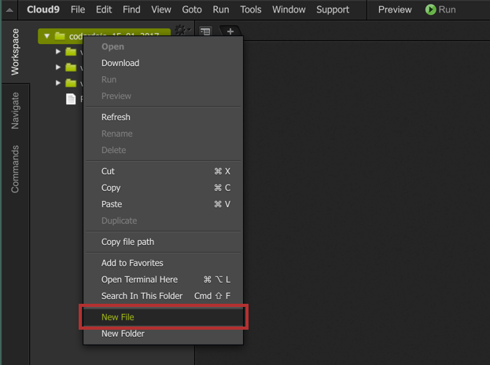{width=70%}

### 4.1 Die Website die das Spiel aufruft

Bevor man beginnen kann, das Spiel mit Phaser in Javascript zu erstellen, benötigt man eine einfache Webseite. Diese Webseite ruft das spätere Spiel auf. Das Spiel selbst wird in einer JavaScript Datei liegen. Diese kann jedoch ohne eine Webseite nicht ausgeführt werden.

#### Die folgenden Zeilen sind die Basis für jede Website:

    <!DOCTYPE html>
	<html>
		<head>

    	</head>
    	<body>

    	</body>
	</html>

Der Bereich zwischen den <b>head-Klammern</b> wird verwendet, um Titel, Verknüpfungen zu anderen Dateien und andere Attribute für die Website zu definieren. Es sind alles informationen die man nicht direkt angezeigt bekommt wenn man eine Website aufruft. Hier werden auch die Verknüpfungen zum Spiel gelegt

    <title>Mein 1. Spiel</title>
        
    
    

Der Bereich zwischen den <b>body-Klammern</b> wird verwendet um den Inhalt zu beschreiben. Hier kommen normalerweise Inhalte hin. Da jedoch Phaser für dieses Projekt verwendet wird, bleibt dieser Teil in diesem Fall leer.

### 4.2 Die Datei in die das Spiel kommt

Damit man anfangen kan die Ideen zu programmieren, braucht man einen Platz an dem man etwas schreiben kann. Dafür erstellt man zunächst eine Datei mit dem Namen <b>"game.js"</b>. 

In diese müsst ihr nun folgende Zeilen schreiben:

    window.onload = function(){

    	// 1. Variablen

    	// 2. Das Spiel

    	// 3. Die Zustände des Spiels ( Anfangsbildschirm, Spielansicht )

    }

 Dieser Block wird in den nächsten Schritten erweitert.

## 5. Die ersten Zeilen Code

 Damit man die nächsten Aufgabe mitmachen kann, müssen zwei weitere Bild-Dateien zum Projekt hinzugefügt werden. Damit man nicht alle Dateien lose verteilt hat, sollte man sich einen Ordner für die Bilder anlegen. Die Bilder werden dir gestellt.

 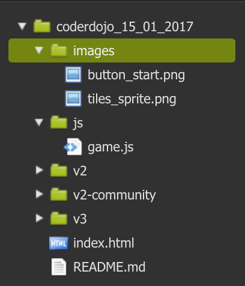{width=300px}

Nun kann man immer direkt auf die Bilder im Ordner <b>"images"</b> zugreifen und muss nicht lange suchen.

### 5.1 Wir erstellen das Spiel

Bevor man etwas zum Spiel hinzufügen kann ( z.B. Texte und Bilder ), muss man erstmal ein Spiel erstellen. Schreibe die folgende Zeilen in den Bereich <b>"// 1. Variablen"</b> den wir im letzten Kapitel definiert haben.

	var game = new Phaser.Game(500, 500);

Das ist das Objekt in dem sich bereits bestimmte Voreinstellungen zum Spiel befinden und dem noch weitere Eigenschaften hinzugefügt werden.
Um einen Spielbereich zu definieren, fügt man bei den Platzhaltern <b>// 2. Das Spiel</b> folgende Zeilen hinzu:

	var gameScreen = function(game){}
    gameScreen.prototype = {

    	// 1. Variablen

    	// 2. Vordefinierte / Eigene Methoden

    }

Jeder Spielbereich der dem Spiel wie zuvor hinzugefügt wird, muss in einem weiteren Schritt als Bereich festgelegt werden.

	game.state.add("GameScreen", gameScreen);

Damit das Spiel weiß, dass es diese Ansicht wählen soll, wenn es aufgerufen wird, muss man noch einen Bereich festlegen an dem es starten soll.

	game.state.start("GameScreen");

Wenn alles geklappt hat sollte man absofort ein schwarzes Spielfeld sehen, wenn man das Spiel aufruft. Dazu muss man die Website erstmal aktivieren. Dazu wählt man die Datei <b>index.html</b> auf und drückt am oberen Rand auf die grüne <b>"Run"</b> Schaltfläche

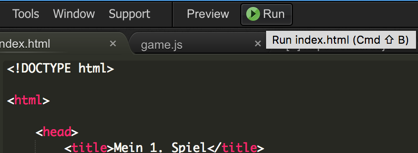{width=500px}

Falls man keine Fehler im Projekt hat, wird sich die Website aktivieren lassen und man kann in einem weiteren Schritt auf der Schaltfläche <b>"Preview"</b> die Anwendung in einem zusätzlichen Fenster aufrufen.

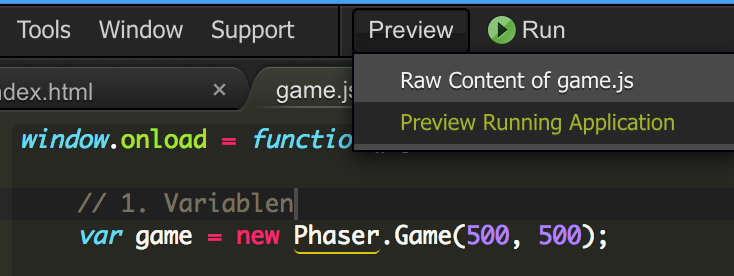{width=500px}

### 5.2 Text hinzufügen

In der Mitte des Spielfeldes wird ein Textfeld definiert, das am Anfang die Aufgabe beschreiben soll und nach dem Start des Spiels die jeweiligen Farben ausgeschrieben anzeigt. Damit man auf das Textfeld auch später noch zugreifen kann, wird dafür eine Variable definiert. Ein leerer Platzhalter der direkt zu Beginn eines Spielbereichs kommt.

	gameScreen.prototype = {

		// 1. Variablenbereich innerhalb eines Spielbereichs
		textfeldFarbenText: null,

Für Prototypen gibt es bei Phaser mehrere vordefinierte Bereiche. Einer davon heißt <b>"create"</b> und wird erst ausgeführt, sobald Phaser bereit ist und alle anderen nötigen Ressourcen geladen hat.
Diese Funktion wird folgendermaßen geschrieben

		// 2. Vordefinierte Methoden
		create: function(){

		},

Innerhalb dieser Klammern kann nun ein Textfeld zum Spiel hinzugefügt werden. Für das Textfeld müssen wir noch die Schrift genauer bestimmen und zuweisen, als auch die Position im Spielfeld belegen:

	var styleTextFeld = {
		font: "40px Monospace",
        fill: "#ff7f00",
        align: "center"
	}

	this.textfeldFarbenText = game.add.text(game.width / 2,
										    game.height / 2,
										    "Wähle die Farbe aus die du liest!",
									   		styleTextFeld);
    this.textfeldFarbenText.anchor.set(0.5);

Das Textfeld besitzt 4 Attribute in folgender Reihenfolge: Position x, Position y, Text, Aussehen. Die darauf folgende Zeile bewirkt, dass das Textfeld genau mittig ausgerichtet wird. 
Wenn man nun die Seite nachlädt, sollte man den Text mittig zentriert angezeigt bekommen.

Damit wir später noch öfters mit der gleichen Schrift TextFelder erstellen können werden wir die Variable global definieren und direkt am Anfang der Datei, nach dem Spiel definieren

	var game = new Phaser.Game(500, 500);
	var styleTextFeld;

Es würde in diesem Fall nicht zu Fehlern führen, allerdings ist es üblich, eine Variable nur an einem Ort zu definieren. Deshalb sollte man auch das <b>"var"</b> in den Zeilen zuvor entfernen und direkt auf die neue Variable zugreifen

	styleTextFeld = {
		font: "40px Monospace",
        fill: "#ff7f00",
        align: "center"
	}

### 5.3 Anzeigen von Bildern

Damit Bilder angezeigt werden können, muss zunächst die Bilddatei in einer Funktion vorgeladen werden damit es bereit ist, wenn darauf zugegriffen werden soll. Dazu muss eine weitere vordefinierte Funktion hinzugefügt werden. Diese sollte man am besten vor die Funktion <b>create</b> setzen da sie vor ihr ausgeführt wird:

	preload: function(){

	},

In diesem Teil wird das Bild mit folgenden Zeilen geladen

	game.load.spriteSheet("tiles_sprite",
						  "images/tiles_sprite.png",
						  50,
						  50);

Damit wir später nicht immer wieder an allen Stellen die Größe ändern müssen wenn wir andere Werte probieren wollen, empfielt es sich dafür eine Variable zu erstellen, die man nur an einer Stelle belegt. Schreibt hierzu direkt unter die Variable unseres Spiels, eine Variable für die Höhe und Breite einer Kachel.

	var game = Phaser.Game(500,500);
	var tileSize = 50;

Nun kann man die Zahlen durch das Wort <b>"tileSize"</b> ersetzen

	game.load.spriteSheet("tiles_sprite",
						  "images/tiles_sprite.png",
						  tileSize,
						  tileSize);

Da wir ein Farbenspiel machen wollen, wäre es auch gut den Hintergrund des Spielfeldes von schwarz in etwas buntes zu ändern. Man muss dazu noch folgende Zeile in die funktion <b>preload</b> einfügen

	game.stage.backgroundColor = "#4f3370";

Beim Laden des Bildes sind folgende Attribute nacheinander zu belegen: Name mit dem man das Bild später wieder aufruft, Pfad des Bildes im Projekt, Bildbreite, Bildhöhe. Die Breite und Höhe bezieht sich jedoch auf die Höhe der einzelnen Kacheln die innerhalb des Bildes verteilt sind. Dadurch kann Phaser das Bild selbständig unterteilen und anhand von Nummern direkt aufrufen.

In die zuvor erstellte Funktion <b>create</b> kann jetzt das Bild hinzugefügt werden. Dazu wird ein Button erstellt, der das Bild erhalten wird

	var button = game.add.button(game.width / 2,
			                    game.height / 2 - 100,
			                    "tiles_sprite",
			                    this.buttonPress,
			                    this);                
    button.anchor.set(0.5);
    button.frame = 0;

Der Button wir erstellt, mittig positioniert und es wird die Nummer des Bildes gesetzt, das angezeigt werden soll

Im Button wurde auch definiert was passieren soll, sobald er gedrückt wird. Da es diese Funktion noch nicht gibt, muss eine weitere mit dem Namen <b>"buttonPress"</b> erstellt werden. Diese wird direkt unter die Funktion "create" platziert

	buttonPress: function(target){
		console.log("Ich habe Bild Nr.: " + target.frame);
	}

Drückt man den Button, wird jedes Mal eine Nachricht in der Konsole des Browsers ausgegeben und beschreibt welche Bildnummer der Button besitzt.

Diese Funktion unterscheidet sich von den beiden vorherigen, sie hat einen Wert innerhalb der Klammern, <b>"target"</b>. Das ist eine Referenz des Buttons. Hierdurch kann auf den Button und dessen Attribute zugegriffen werden. Unter <b>"frame"</b> ist der Wert als Zahl hinterlegt.

#### Die Konsole aufrufen

Die Konsole muss bei jeder Website erst geöffnet werden bevor man sie sehen kann. Dazu muss man auf der Website auf irgendeinen Bereich klicken und <b>Rechtsklick -> Untersuchen</b> anwählen

Normalerweise wird nun der Text der HTML-Datei angezeigt. Für die Konsole muss man den zweiten Reiter auswählen. Wählt man nun die einzelnen Farben erneut an, werden nach und nach einzelne Zeilen in der Konsole erscheinen und uns die entsprechenden Werte ausgeben

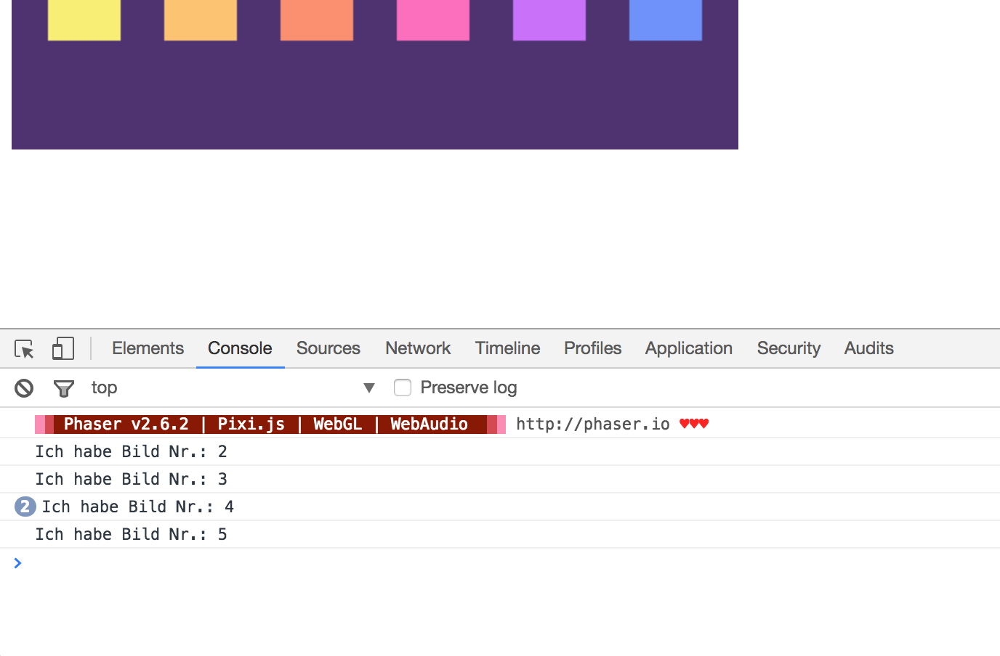{width=80%}

#### Warum hat das Bild die Nummer 0

Beim Programmieren beginnt man oft bei der Zahl 0 statt der 1. Ein Beispiel ist die Auswahl der einzelnen Kacheln innerhalb des Bildes "tiles_sprite.png". 0 ist die erste Kachel oben links in gelb. Deshalb ist die letzte Kachel unten rechts im Bild die Nummer 19, und nicht die Nummer 20.

Es heißt nicht dass man immer bei 0 anfängt, aber hin und wieder sind manche Dinge so entworfen, dass sie bei 0 beginnen, oder es bietet sich an einen Anfangswert wie 0 zu haben, ein Punktestand zu Spielbeginn beispielsweise.
Bei Zahlen nimmt man <b>"0"</b>, bei Objekten wie TextFeldern oder Buttons schreibt man <b>"null"</b>. 

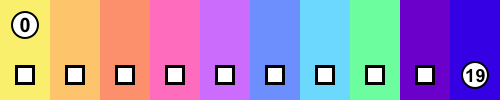{width=80%}

### 5.4 Mehr Buttons mit Schleifen

Es gibt bisher nur eine Kachel zu sehen. Insgesamt gibt aber 20 von unserem Bild auswählen. Theoretisch wäre es möglich alle Buttons nacheinander hinzuzufügen. Man kann jedoch auch eine Schleife erzeugen, die diese Arbeit übernimmt. Eine normale Schleife sieht folgender Maßen aus

    for ( var int i = 0; i < 6; i++ ){

    }

Der Block ist in drei Bereiche aufgeteilt und durch Semikolons getrennt:
	
	1. Eine Variable bei der wir beginnen
	2. Anzahl der Wiederholungen, hier wird es ausgeführt, so lange die Variable kleiner ist als 6
	3. Hochzählen der Variable +1 

Nun fügen wir die Zeilen die wir zuvor geschrieben haben in diese Schleife.

	for ( var i = 0; i < 6; i++ ){
        var button = game.add.button(tileSize + i * 80,
                                     game.height - 100,
                                     "tiles_sprite",
                                     this.buttonPress,
                                     this);
        button.anchor.set(0.5);
        button.frame = i;
    }

Um zu überprüfen, ob alles richtig funktioniert hat, kann man den aktuellen Stand der Datei <b>"game.js"</b> im folgenden Codeblock vergleichen

	window.onload = function(){
    
	    // 1. Variablen
	    var game = new Phaser.Game(500, 500);
	    var styleForText;
	    var tileSize = 50;
	    
	    var gameScreen = function(game){}
	    gameScreen.prototype = {
	        
	        textfeldFarbenText: null,

	        preload: function(){
	            game.load.spritesheet("tiles_sprite",
	                                  "images/tiles_sprite.png",
	                                  tileSize,
	                                  tileSize);
	            game.stage.backgroundColor = "#4f3370";
	        },
	        
	        create: function(){
	            
	            styleForText = {
	                font:"40px arial",
	                fill:"#ff7f00",
	                align:"center"
	            }
	            
	            this.textfeldFarbenText = game.add.text(game.width / 2,
	                                                    game.height / 2,
	                                                    "Bereite dich vor",
	                                                    styleForText);
	            this.textfeldFarbenText.anchor.set(0.5);
	            
	            for ( var i = 0; i < 6; i++ ){
	                var button = game.add.button(tileSize + i * 80,
	                                             game.height - 100,
	                                             "tiles_sprite",
	                                             this.buttonPress,
	                                             this);
	                button.anchor.set(0.5);
	                button.frame = i;
	            }
	        },
	        
	        buttonPress: function(target){
	           console.log("Ich habe Bild Nr.: " + target.frame);
	        }
	    }
	    // states
	    game.state.add("GameScreen", gameScreen);
	    game.state.start("GameScreen");   
	}

## 6. Arrays und Bedingungen

Damit das Textfeld die Farben als Text ausgeschrieben zeigt, müssen die Wörter für die verschiedenen Farben definiert werden. Außerdem soll sich auch die Farbe des Textes ändern, am besten ein zufälliger Wert. Hierzu definiert man direkt am Anfang der Klasse zwei neue Variablen, sogenannte <b>"Arrays"</b>

	var tileSize = 50;
	var arrayColorAsText = ["gelb", "orange", "rot", "rosa", "lila", "blau"];
    var arrayColorAsHex = ["#FD906C","#FAF06C", "#FDC46C", "#FD6CBD", "#CB6CFD", "6C90FD"];

### 6.1 Farben und Wörter aussuchen

 Alle Werte müssen durch ein Komma getrennt werden. Jede einzelne Stelle kann über die jeweilige Position ausgesucht werden, wichtig ist hierbei nur, dass wir bei 0 zu zählen beginnen! Um rot zu erhalten, müsste man folgende Zeile eingeben

 	arrayColorAsText[2];

 Das zweite Array besitzt die jeweiligen Farben die wir auch bereits am unteren Bereich durch Kachen verteilt haben. Im letzten Kapitel wurden die Farben durch Bilder belegt. In diesem Fall soll jedoch der Text in einem Textfeld geändert werden. Deshalb ist es notwendig die entsprechenden Farbwerte zu wissen. Ein Beispiel für verschiedene andere Werte kann man auf folgendem Bild sehen

 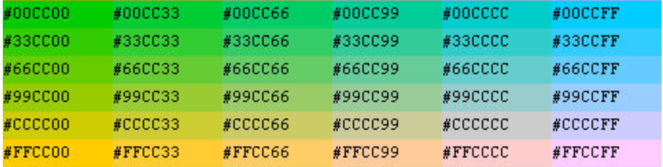{width=80%}

 Die Werte sollen jeweils zufällig gewählt werden, sowohl der Text als auch die Farbe. Hierzu wird eine neue Funktion unter die bereits vorhandenen hinzugefügt 

 	changeColorLabel: function(){
            var randomTextSelect = game.rnd.integerInRange(0, arrayColorAsHex.length-1);
            this.textfeldFarbenText.text = arrayColorAsText[randomTextSelect];
            
            var randomColorSelect = game.rnd.integerInRange(0, arrayColorAsHex.length-1);
            this.textfeldFarbenText.addColor(arrayColorAsHex[randomColorSelect], 0);                                            
    }

Wir generieren zunächst eine zufällig Zahl mit der Funktion

	game.rnd.integerInRange(ZahlVon, ZahlBis)

dabei legt man einen Wertebereich fest, in dem eine Zufallszahl gebildet werden soll. Da auf die Werte im <b>arrayColorAsText</b> zugegriffen wird, beginnen wir bei <b>0</b> und hören am Ende des Arrays auf. Wie bereits erwähnt, bginnt man bei einem Array bei 0, wenn man den ersten Wert abrufen möchte. Man darf somit nicht die wirkliche Anzahl der Elemente in einem Array als Endwert nehmen, sondern muss diesen um 1 reduzieren

	arrayColorAsHex.length - 1

In einem letzten Schritt wird der zufällige Wert ausgewählt

	arrayColorAsText[randomTextSelect];

und dem Textfeld übergeben

	this.textfeldFarbenText.text

Damit Der Text direkt zu Spielbeginn einen zufälliger Wert annimmt, muss man sowohl in der Funktion <b>create</b> und <b>buttonPress</b> einen Wert für die Farbe und den Text festlegen. Die zuvor erstellte Funktion ist genau für diese Aufgabe zuständig und kann mit einer Zeile aufgerufen werden

    this.changeColorLabel();

###6.2 Auswahl überprüfen

Jedes Mal, wenn ein Button ausgewählt wird, wechselt die Farbe und der Text beliebig, allerdings auch, wenn nicht die richtige Farbe ausgewählt wurde. Es ist deshalb wichtig, innerhalb der Funktion `buttonPress` zu prüfen, ob die Auswhahl richtig wahr. 
Mit Hilfe der Variable `target`, erhält man Zugriff auf den gedrückten Button. Man muss nun die Werte des gedrückten Buttons mit denen des Textfeldes vergleichen

    if( arrayColorAsText[target.frame] === this.labelColoredText.text ){
    	this.changeColorLabel();
    } else {
    	// falsche Farbe ausgewählt
    }

 Mit Hilfe von `arrayColorAsText[target.frame]` erhält man die Farbe als Text für die entsprechende Farbnummer die im `frame` hinterlegt ist. Den Text kann man dann mit dem Text innerhalb des Textfeldes in der Mitte des Spielfeldes vergleichen. 
 Ist der Wert richtig, ruft man die Funktion `changeColorLabel()` aus um die Werte für die nächste Auswahl zu ändern. Ist der ausgewählte Wert falsch, wird der Bereich in den Klammern nach dem `else` ausgeführt. Dieser wird im nächsten Teil ergänzt.

<!--
# 7. Das Spiel auf Zeit

Nun werden die Farben richtig überprüft, allerdings gibt es noch keine Herausforderung. Um das Spiel schwerer zu machen, wird ein Zeitwert eingeführt der von Level zu Level niedriger wird und dem Spieler weniger Zeit zum nachdenken lässt.

## 7.1 Zeit speichern und herunterzählen

Um die Zeit herunterzuzählen, benötigt man eine Variable die den Zeitwert speichert. Dieser Wert muss dann, automatisiert jede Sekunde um eins reduziert werden. 

Damit die Zeit angezeigt werden kann, benötigt man ein weiteres Textfeld, in der die Zeit dargestellt wird. Deshalb fügen wir zu Beginn des Spiels 

Für den Zeitwert wird eine neue Variable am Anfang der Datei unter den bereits vorhandenen hinzugefügt

    var timeLeft;

Innerhalb der Funktion `create` muss ein Wert festgelegt werden bei dem die Zeit immer beginnt herunterzuzählen. In diesem Beispiel wird der Wert auf 10 Sekunden gelegt.

	timeLeft = 10;

## 7.2 Funktion um Spielfeld zu erstellen

# 8. Das Ende und der Anfang des Spiels

# 9. Neue Spielvarianten
-->